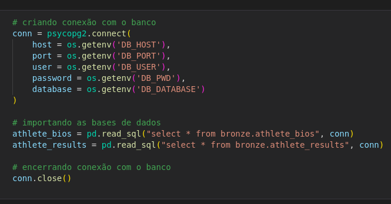
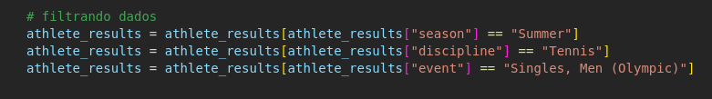
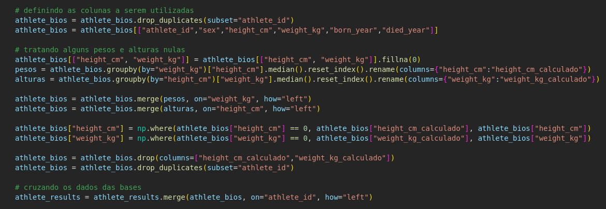
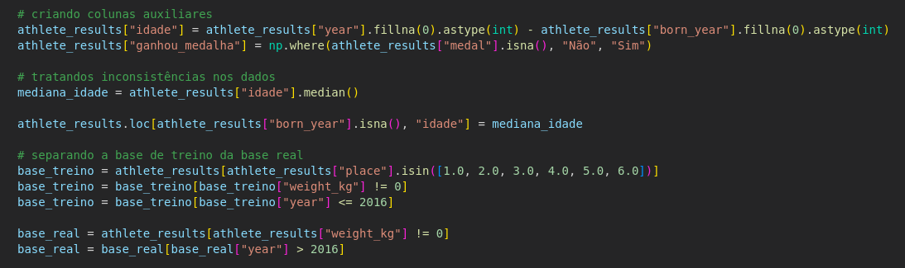
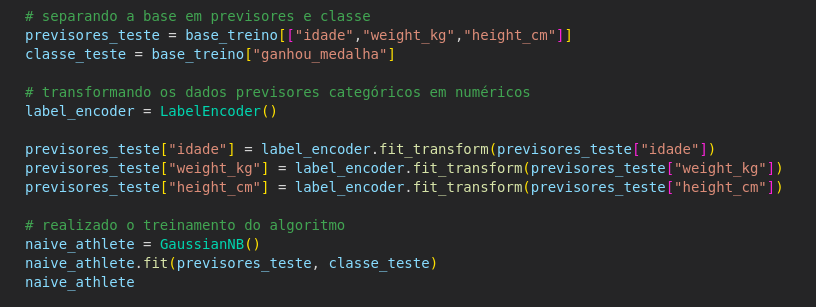
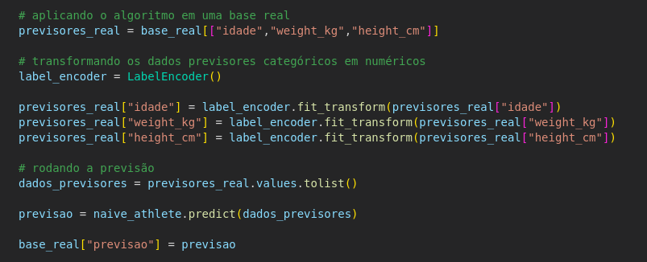
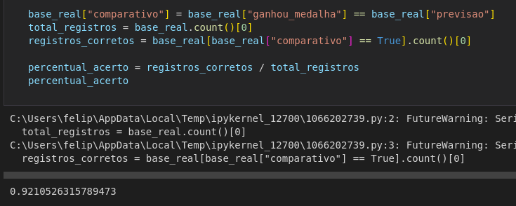
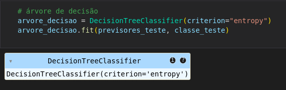
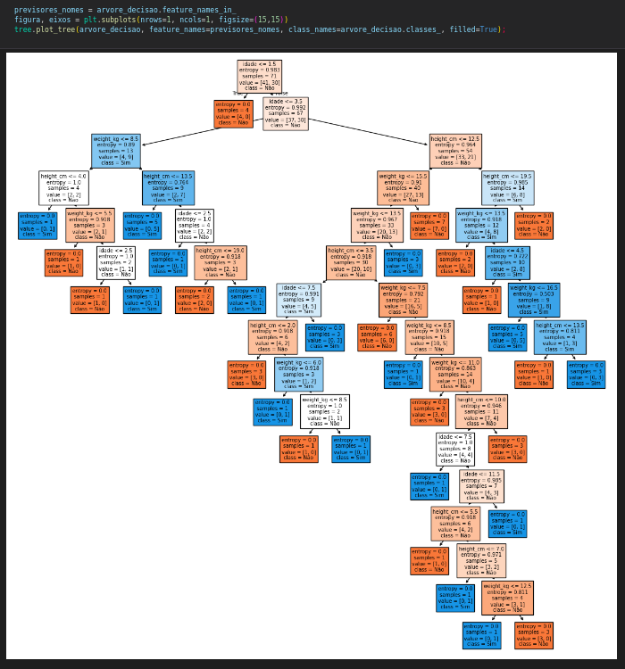

Para aplicar algum tipo de algoritmo de aprendizagem de máquina, é necessário realizar a coleta dos dados. Utilizando o Python, importamos as bibliotecas necessárias para o realizarmos o projeto e carregamos os dados em dois Dataframes diferentes.

Após entendimento dos dados coletados e relacionando com a análise que gostaríamos de fazer, percebemos que seria necessário aplicar alguns filtros nas bases de dados para conseguirmos compararmos dados mais compatíveis. Como o intuito do algoritmo é prever os ganhadores de alguma medalha nas próximas olimpíadas com base nos aspectos físicos dos atletas (idade, altura e peso), aplicamos um filtro para analisarmos os dados de uma mesma modalidade olímpica e do mesmo sexo, visto que características físicas variam de acordo com a modalidade e o sexo dos atletas.
Nesta análise, escolhemos a modalidade de Tennis, olhamos para o evento de jogos masculinos de modo individual. Padronizamos também a temporada das olimpíadas para “Summer”, com intuito de analisarmos os dados o mais coerente possível.

Após definida a base final da análise, foi necessário aplicar algumas tratativas na mesma para conseguirmos ter uma análise mais assertiva. Primeiro, tratamos os valores vazios que serão usados nas previsões dos algoritmos como o peso e a altura dos atletas. Devido ao volume considerável de atletas sem essas informações, pegamos a mediana das alturas de acordo com o peso dos outros atletas e fizemos a mesma coisa com o peso dos atletas com base nas alturas. Com isso, obtemos um valor aproximado dos pesos e alturas dos atletas com base no peso e a altura de outros atletas e preenchemos os valores faltantes quando tinham apenas uma característica inválida.
Após tratarmos alguns valores faltantes, realizamos a junção das duas bases para termos as características dos atletas na mesma base dos resultados dos jogos olímpicos.

O próximo passo foi criar algumas colunas adicionais para a análise. As colunas criadas foram a idade dos atletas e se ganhou medalha. A idade foi calculada com base no nascimento dos atletas com o ano que aconteceu as olimpíadas, para termos a idade correta dos mesmos durante a competição e ajustamos os valores nulos com a mediana das idades de todos os atletas. A coluna informando se ganhou medalha foi para termos uma classificação mais simplificada do resultado que vamos obter no final da análise.
Feito isso, aplicamos alguns filtros na base que utilizamos para o treino do algoritmo. Optamos por dados das colocações do primeiro lugar no pódio até o sexto lugar, assim igualamos a quantidade de vencedores de medalhas com a quantidade de perdedores. Este filtro foi feito após percebermos que se pegarmos a base toda, teremos um volume muito desproporcional de perdedores do que vencedores de medalha e o algoritmo passava a classificar todos os atletas como perdedores. Outros filtros aplicados foram os registros que não tinham informações das características dos atletas e dados da primeira olimpíada até o ano de 2016, pois assim, foi utilizado o ano de 2020 para realizar a previsão e comparar os resultados.

Após termos a base de teste e base para compararmos os valores das previsões prontas, escolhemos o algoritmo Naive Bayes para realizarmos as previsões.

O Naive Bayes é um algoritmo de aprendizagem de máquina de classificação de dados que gera uma tabela de probabilidades para cada classificação em cada registro e escolhe a classificação com a maior probabilidade de acontecer. O mesmo possui uma característica de um aprendizado supervisionado, onde passamos um histórico de dados com as respostas e, com base neste histórico, classificar os futuros registros.

A primeira tratativa a ser feita é informar os previsores (informações que ele terá para calcular o resultado) e a classe (resultado que ele precisa informar) com base na base histórica que iremos passar para o treinamento do algoritmo. Definido os previsores e a classe, foi necessário transformar os dados previsores para uma mesma escala, pois assim o algoritmo não atribui um peso desproporcional para nenhuma variável. Logo após, submetemos o algoritmo para um treinamento.

O algoritmo treinado, realiza as mesmas tratativas da escala dos dados dos previsores na base com os dados futuros e executamos o algoritmo (já treinado) para classificar a classe com bases nos novos previsores. Com isso, obtemos os novos resultados informando se o atleta vai ganhar uma medalha ou não.

Com base na tabela de 2020 submetida aos testes e os dados reais de 2020, observamos que tivemos uma assertividade de 92% dos dados.

Após termos encontrado o valor de assertividade do Naive Bayes, iremos utilizar o algoritmo de árvore de decisão para compararmos qual tem um melhor desempenho em nossa análise.

O algoritmo de árvore de decisão também é um algoritmo de classificação e de aprendizagem supervisionada, ou seja, precisa de dados históricos classificados para conseguir realizar as previsões. A diferença entre o Naive Bayes é que a árvore de decisão monta um fluxo onde a informação irá percorrer até chegar no resultado final, descartando a ideia da tabela de probabilidade.

Utilizando a mesma base de dados de treino usada no Naive Bayes, iremos realizar o treinamento do algoritmo da árvore de decisão.

Após realizado o treinamento, podemos visualizar o algoritmo de forma gráfico no formato da “árvore”, onde conseguimos visualizar o caminho por onde o algoritmo percorre para classificar cada registro.

Feito isso, iremos pegar a base de dados dos atletas de 2020 e aplicar o algoritmo treinado da árvore de decisão e, assim, obtemos 52% de assertividade do algoritmo.

Com isso, percebemos que o algoritmo Naive Bayes foi mais assertivo para classificar os dados desta base que estamos analisando.
