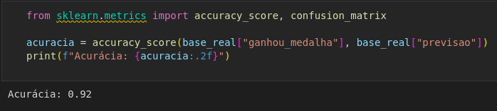
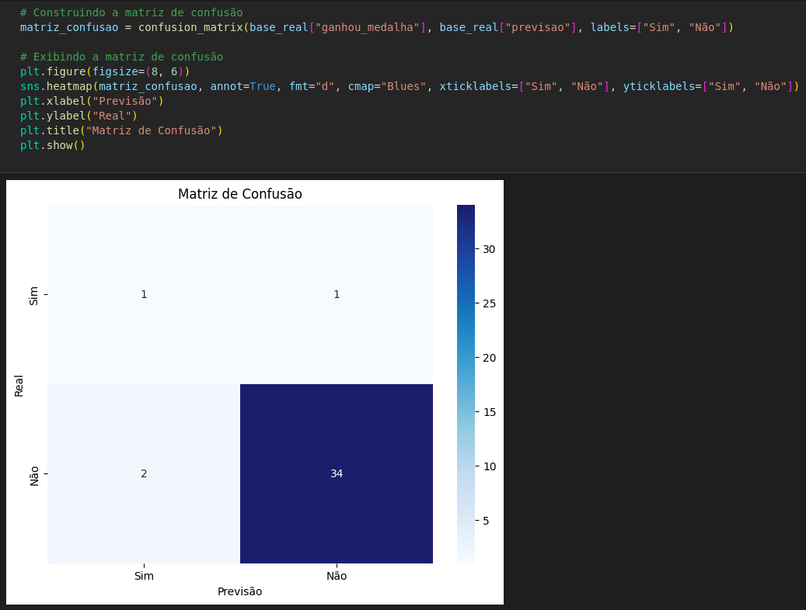

Conforme analisado nos algoritmos, percebemos que o Naive Bayes foi o que teve o maior percentual de assertividade e, por isso, foi o algoritmo escolhido para realizarmos uma análise mais aprofundada.

A primeira análise que realizamos foi o cálculo da acurácia do modelo. Esta métrica mede a proporção de previsões corretas realizadas pelo modelo em relação ao total de previsões feitas, ou seja, ela mede a eficiência do modelo em classificar corretamente os exemplos.

Como ela já tinha sido calculada de forma manual, aqui utilizamos uma biblioteca Python que realiza o cálculo:

Percebemos que a acurácia foi de 92%, ou seja, o algoritmo conseguiu acertar o resultado em 92% dos casos. Um resultado considerado bom no Naive Bayes é um percentual maior que 90%, mas isto pode variar dependendo dos dados e da análise que estão sendo feitas.

Após realizado o cálculo da acurácia, foi criado a matriz de confusão para termos uma análise mais detalhada das assertividades do modelo. A matriz de confusão é uma forma tabular de representar o desempenho de um modelo, mostrando uma visão detalhada de acertos e erros de cada classe.

Interpretando a matriz de confusão, percebemos que ela nos informa um quadrante comparando os valores positivos e negativos dos valores reais e da previsão.

**1º quadrante (Real = Sim e Previsão = Sim):** neste quadrante temos um “verdadeiro positivo" (TP), ou seja, a quantidade de registros que estão marcados como “sim” nos valores reais e que a previsão também marcou como “sim”. Neste caso, percebemos que tivemos um atleta que foi marcado que ganharia a medalha e realmente ele ganhou a medalha.

**2º quadrante (Real = Sim e Previsão = Não):** neste quadrante temos um “falso negativo” (FN), ou seja, a quantidade de registros que estão marcados como “sim” nos valores reais e que a previsão marcou como “não”. Neste caso, um atleta que ganhou medalha foi classificado pelo algoritmo como se não fosse ganhar a medalha.

**3° quadrante (Real = Não e Previsão = Sim):** neste quadrante temos um “falso positivo” (FP), ou seja, a quantidade de registros que estão marcados como “não” nos valores reais eque a previsão marcou como “sim”. Neste caso, um atleta que não ganhou a medalha, mas foi classificado como se tivesse ganhado. Percebemos que tivemos 2 casos classificados desta forma.

**4º quadrante (Real = Não e Previsão = Não):** neste quadrante temos um “verdadeiro negativo” (VP), ou seja, a quantidade de registros que estão marcados como “não” nos valores reais e que a previsão marcou como “não”. Neste caso, um atleta que não ganhou a medalha e que foi classificado corretamente como se não fosse ganhar a medalha. Tivemos 34 casos classificados desta forma.

Observando a matriz de confusão gerada, percebe-se que ela está basicamente acertando somente os “verdadeiros negativos” (4º quadrante), ou seja, atletas que não ganharam medalhas e que foram classificados que não iriam ganhar as medalhas. A matriz nos mostra que o algoritmo está muito bem treinado em acertar os atletas que não vão ganhar as medalhas, mas não necessariamente está bem treinado para acertar os atletas que irão ganhar as medalhas.